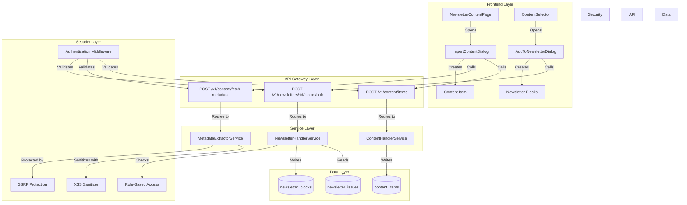
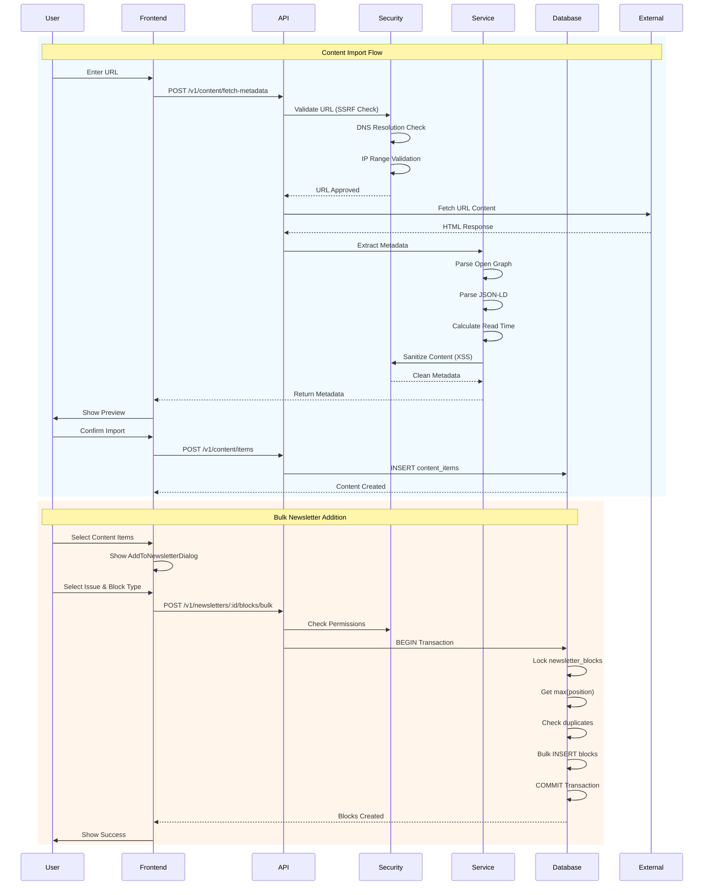
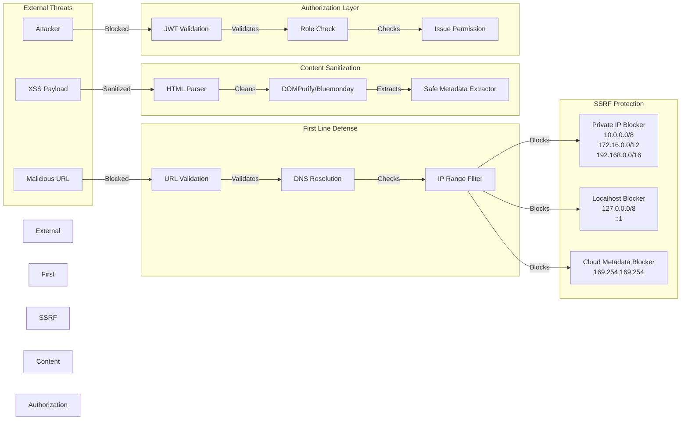
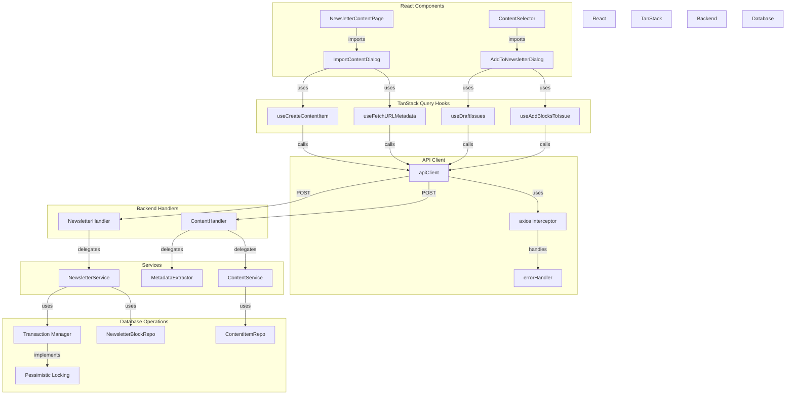
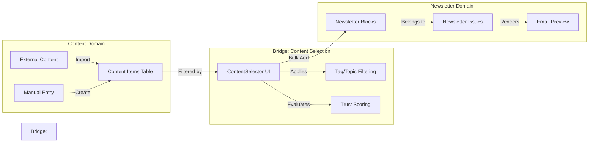
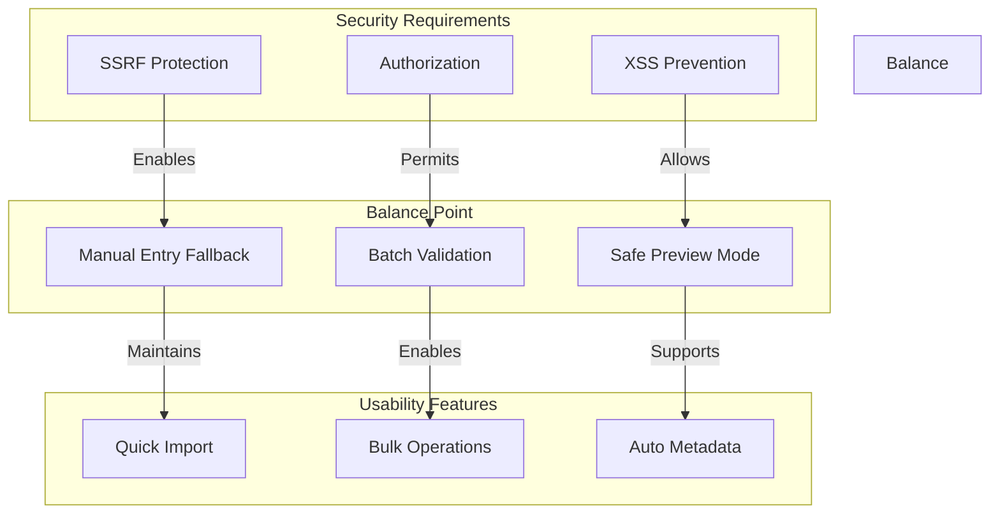
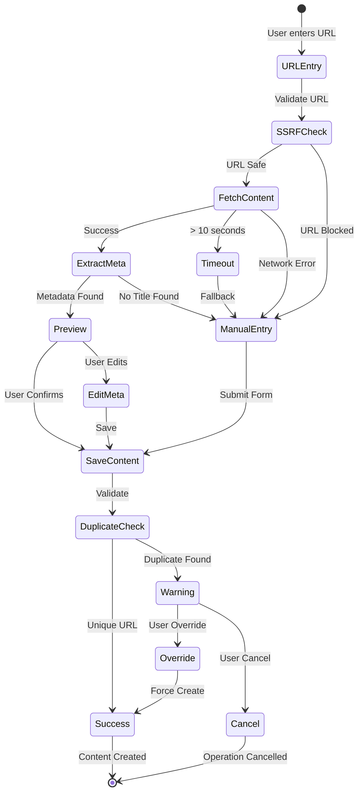
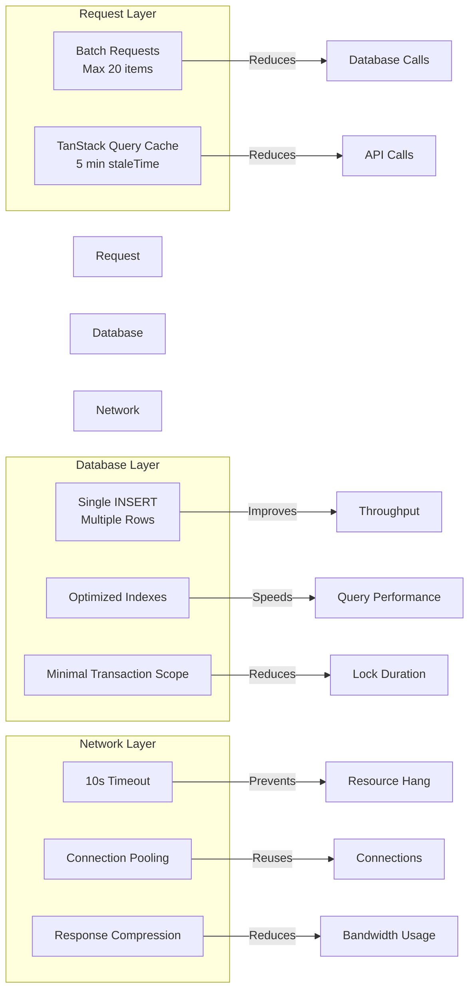
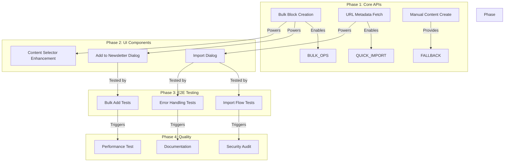

```mermaid
graph TB
    subgraph "OpenTelemetry Spans"
        ROOT[Request Span]
        AUTH_SPAN[Auth Validation]
        SSRF_SPAN[SSRF Check]
        FETCH_SPAN[URL Fetch]
        EXTRACT_SPAN[Metadata Extract]
        DB_SPAN[Database Operation]

        ROOT -->|child| AUTH_SPAN
        ROOT -->|child| SSRF_SPAN
        ROOT -->|child| FETCH_SPAN
        FETCH_SPAN -->|child| EXTRACT_SPAN
        ROOT -->|child| DB_SPAN
    end

    subgraph "Metrics"
        LATENCY[API Latency p95 < 500ms]
        ERROR_RATE[Error Rate < 1%]
        BULK_SIZE[Avg Bulk Size]
        DUP_RATE[Duplicate Rate]
    end

    subgraph "Logs"
        REQ_LOG[Request Logger]
        SEC_LOG[Security Events]
        ERR_LOG[Error Logger]
        AUDIT[Audit Trail]
    end

    subgraph "Alerts"
        HIGH_LAT[High Latency Alert]
        SSRF_ATT[SSRF Attempt Alert]
        BULK_FAIL[Bulk Operation Failure]
    end

    SSRF_SPAN -->|Triggers| SSRF_ATT
    DB_SPAN -->|Measures| LATENCY
    ROOT -->|Logs to| REQ_LOG
    SSRF_SPAN -->|Logs to| SEC_LOG

    style OpenTelemetry Spans fill:#e6f2ff
    style Metrics fill:#e6ffe6
    style Alerts fill:#ffe6e6
```

# Content Pipeline Visual Understanding Map

## 🎯 Feature Overview: Content Pipeline (010-content-pipeline)

The Content Pipeline feature enables bulk content operations for newsletters, bridging external content sources with the newsletter creation system through a secure, scalable API architecture.

---

## 📊 System Architecture Map



---

## 🔄 Data Flow Architecture



---

## 🔒 Security Boundaries & Protection Layers



---

## 🏗️ Component Dependencies & Relationships



---

## ⚡ Concurrency & Transaction Management

```mermaid
graph TB
    subgraph "Bulk Operation Request"
        REQ1[Request 1: Add 5 blocks]
        REQ2[Request 2: Add 3 blocks]
        REQ3[Request 3: Add 2 blocks]
    end

    subgraph "Transaction Boundary"
        BEGIN[BEGIN TRANSACTION]
        LOCK[SELECT FOR UPDATE<br/>newsletter_blocks]

        REQ1 -->|Enters| BEGIN
        REQ2 -->|Waits| BEGIN
        REQ3 -->|Waits| BEGIN

        BEGIN -->|Acquires| LOCK
    end

    subgraph "Critical Section"
        MAX_POS[Get MAX(position)]
        DUP_CHECK[Check Duplicates]
        BULK_INSERT[Bulk INSERT]

        LOCK -->|Reads| MAX_POS
        MAX_POS -->|Validates| DUP_CHECK
        DUP_CHECK -->|Executes| BULK_INSERT
    end

    subgraph "Position Assignment"
        POS_CALC[position = max + row_number()]

        BULK_INSERT -->|Uses| POS_CALC
    end

    subgraph "Commit/Rollback"
        COMMIT[COMMIT]
        ROLLBACK[ROLLBACK]

        BULK_INSERT -->|Success| COMMIT
        BULK_INSERT -->|Error| ROLLBACK
    end

    style Transaction Boundary fill:#ffe6e6
    style Critical Section fill:#e6ffe6
```

---

## 🌉 Cognitive Bridges & Cross-Domain Connections

### 1. **Content Pipeline ↔ Newsletter System**


### 2. **Security ↔ Usability Bridge**


---

## 🚨 Failure Modes & Recovery Patterns



---

## 🔍 Monitoring & Observability Points



---

## 📈 Performance Optimization Patterns



---

## 🎯 Key Architectural Insights

### **Separation of Concerns**
- Content creation is independent of newsletter assignment
- Metadata extraction is isolated from content storage
- Security checks are layered and independent

### **Failure Resilience**
- Every automated process has a manual fallback
- Partial success is supported (skip duplicates, continue with rest)
- Transactions ensure data consistency

### **Security-First Design**
- SSRF protection at network boundary
- XSS sanitization before storage
- Authorization checks at every endpoint

### **Performance Optimization**
- Bulk operations reduce round-trips
- Pessimistic locking prevents race conditions
- Indexes optimize common query patterns

### **User Experience Balance**
- Quick import with automatic metadata extraction
- Manual override for all automated decisions
- Clear feedback on success, skips, and failures

---

## 🔗 Integration Points

### **Existing Systems**
1. **Newsletter System**: Blocks, Issues, Segments
2. **Content System**: Sources, Items, Tags
3. **Auth System**: JWT, Roles, Permissions
4. **Monitoring**: OpenTelemetry, Prometheus

### **External Services**
1. **Web Content**: URL fetching with timeout
2. **Metadata Standards**: Open Graph, JSON-LD, meta tags
3. **Security Services**: DNS resolution, IP validation

### **Future Extensions**
1. **AI Enhancement**: Content summarization, tag suggestion
2. **Analytics**: Click tracking, engagement metrics
3. **Automation**: Scheduled imports, RSS feeds
4. **Collaboration**: Content approval workflows

---

## 🚀 Implementation Priority Map



---

## 📝 Summary

The Content Pipeline feature represents a complex integration of multiple systems with careful attention to:

1. **Security boundaries** - Multi-layered protection against SSRF, XSS, and unauthorized access
2. **Data consistency** - Transactional operations with pessimistic locking
3. **User experience** - Balance between automation and manual control
4. **Performance** - Bulk operations and strategic caching
5. **Resilience** - Fallback mechanisms for every automated process

The architecture successfully bridges the gap between external content sources and the internal newsletter system while maintaining security, performance, and usability standards.